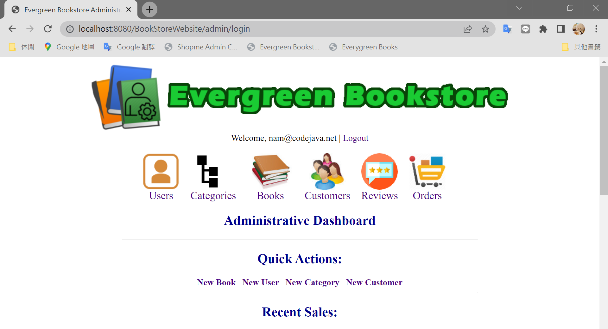
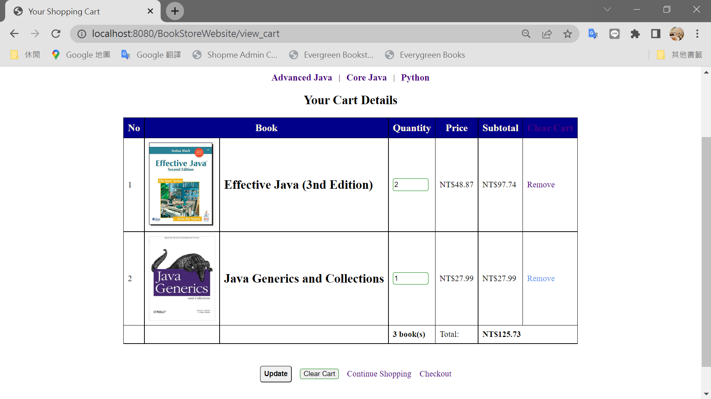

# BookStore

## 簡介
本篇參考Udemy課程 Java Servlet, JSP and Hibernate: Build eCommerce Website(Nam Ha Minh)，所練習的購物車作品，使用JAVA語言，架構為Servlet+JSP，分為管理員管理後台以及使用者購物前台。
## 作品如下
###### 1-1. Admin 登入

###### 1-2. Admin 歡迎頁面

###### 1-3. Admin 後台使用者列表

###### 1-4. Admin 後台使用者新增

###### 1-5. Admin 書籍分類列表

###### 1-6. Admin 書籍分類新增

###### 1-7. Admin 書籍列表

###### 1-8. Admin 書籍新增

###### 1-9. Admin 前台使用者列表

###### 1-10. Admin 前台使用者新增

###### 1-11. Admin 評論列表

###### 1-12. Admin 訂單列表

###### 1-13. Admin 訂單明細

###### 2-1. 購物車首頁

###### 2-2. 購物車登入

###### 2-3. 購物車使用者資訊

###### 2-4. 購物車訂單

###### 2-5. 購物車書籍

###### 2-6. 購物車內容

###### 2-7. 購物車結帳

###### 2-8. 購物車結帳成功

###### 2-9. 購物車訂單明細

## 參考
Udemy：Java Servlet, JSP and Hibernate: Build eCommerce Website(Nam Ha Minh)